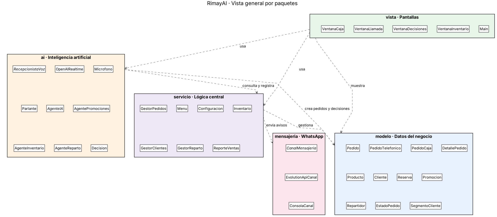
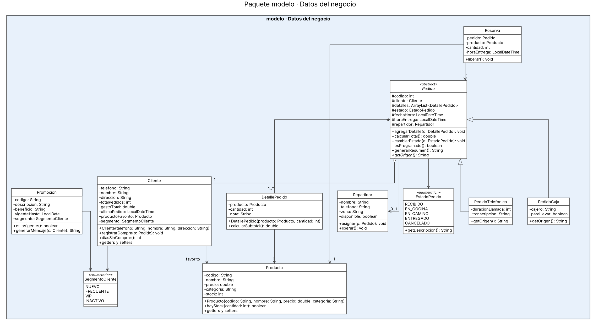
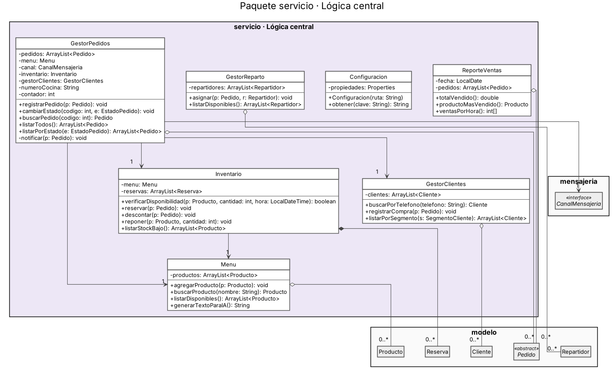
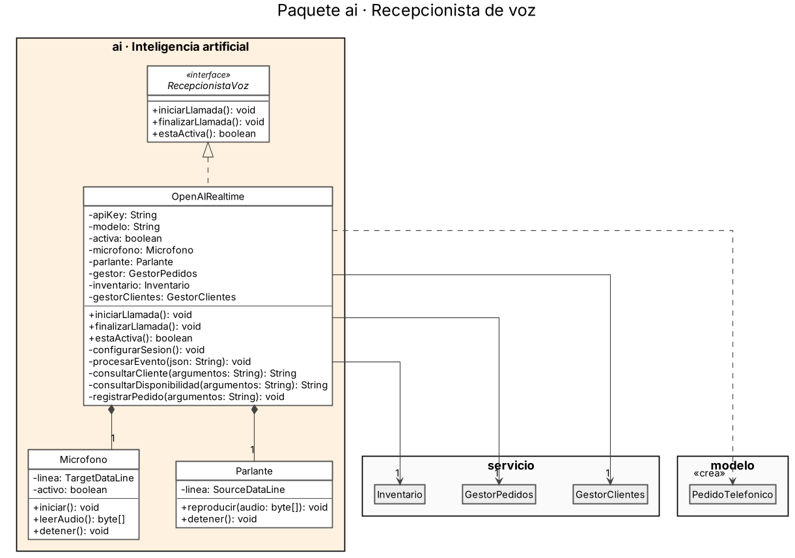
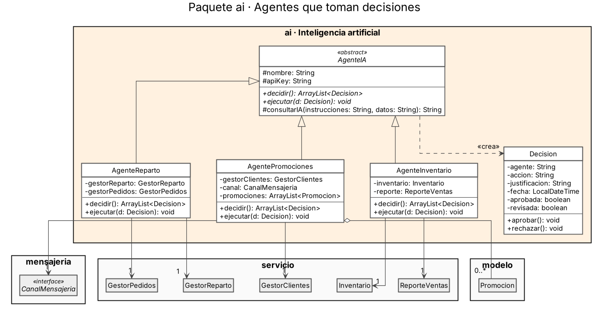
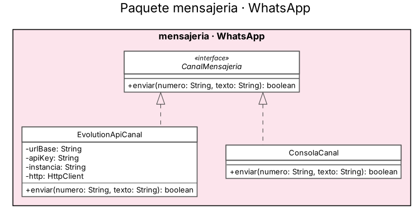
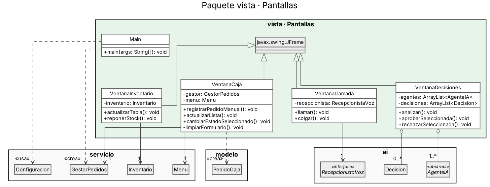
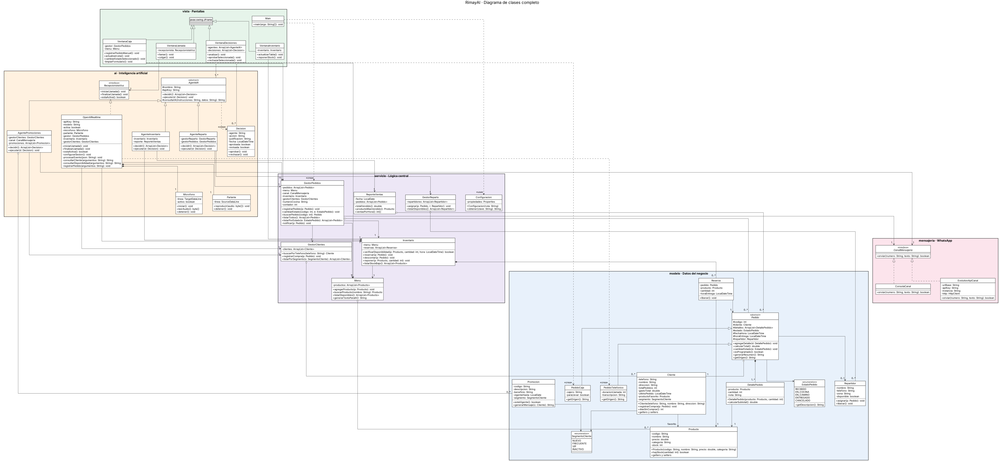

# RimayAI

### Sistema de pedidos para pollerías con recepcionista de voz y agentes de inteligencia artificial

 

 

 

---

## ¿Qué problema resuelve?

En hora punta, una pollería no alcanza a atender todas las llamadas y pierde pedidos. **RimayAI** asigna esa tarea a una recepcionista de inteligencia artificial que conversa por voz, identifica al cliente, verifica el stock disponible y registra el pedido sin intervención humana.

Además, un conjunto de **agentes de IA analiza la operación diaria** y propone decisiones fundamentadas sobre promociones, reposición de stock y asignación de repartidores. Cada propuesta incluye su justificación y la decisión final siempre la toma una persona.

> [!NOTE]
> El sistema **funciona completo sin IA**. La inteligencia artificial automatiza y potencia la operación, pero si no está disponible, la cajera continúa trabajando con normalidad desde la caja.

## Funcionalidades

| Función | Descripción |
|---|---|
| **Caja** | Registro manual de pedidos, seguimiento de todos los pedidos y actualización de su estado |
| **Recepcionista IA** | Atiende llamadas por voz en tiempo real, reconoce al cliente y le sugiere su pedido habitual |
| **Stock en tiempo real** | Verifica la disponibilidad antes de confirmar cada pedido y reserva productos para entregas programadas |
| **Agente de promociones** | Analiza el historial de compras y propone beneficios para clientes frecuentes y para recuperar clientes inactivos |
| **Agente de inventario** | Proyecta cuándo se agotará cada producto según el ritmo de ventas y recomienda reponer a tiempo |
| **Agente de reparto** | Sugiere el repartidor más adecuado para cada pedido según su disponibilidad y zona |
| **Panel de decisiones** | Centraliza las propuestas de los agentes para que la cajera las apruebe o rechace |
| **WhatsApp** | Notifica al cliente la confirmación, cada cambio de estado y sus promociones; envía cada pedido nuevo a cocina |

## Estructura del proyecto

El sistema está compuesto por **35 clases** distribuidas en **5 paquetes**, cada uno con una responsabilidad definida.

| Paquete | Responsabilidad | Clases |
|---|---|---|
| `modelo` | Entidades del negocio | Pedido, PedidoTelefonico, PedidoCaja, DetallePedido, Producto, Cliente, Reserva, Promocion, Repartidor, EstadoPedido, SegmentoCliente |
| `servicio` | Lógica de negocio | GestorPedidos, Menu, Configuracion, Inventario, GestorClientes, GestorReparto, ReporteVentas |
| `ai` | Inteligencia artificial | RecepcionistaVoz, OpenAIRealtime, Microfono, Parlante, AgenteIA, AgentePromociones, AgenteInventario, AgenteReparto, Decision |
| `mensajeria` | Notificaciones | CanalMensajeria, EvolutionApiCanal, ConsolaCanal |
| `vista` | Interfaz gráfica | VentanaCaja, VentanaLlamada, VentanaDecisiones, VentanaInventario, Main |

## Diagrama UML

### Vista general

<b>Ver el detalle de cada paquete</b>

### modelo

### servicio

### ai · Recepcionista de voz

### ai · Agentes de decisión

### mensajeria

### vista

### Diagrama completo

## Tecnologías

- **Java 21** con **Maven** como lenguaje y gestor del proyecto
- **Swing** (NetBeans) para la interfaz gráfica
- **OpenAI Realtime API** para la conversación por voz en tiempo real
- **OpenAI API** para el análisis y las decisiones de los agentes
- **Evolution API** (open source) para la mensajería por WhatsApp

## Equipo

- Fabian Ordoñez
- Marielena Valladares
- Rafael Flores
- Lenning Sandoval

---

Programación Orientada a Objetos - Universidad Tecnológica del Perú

