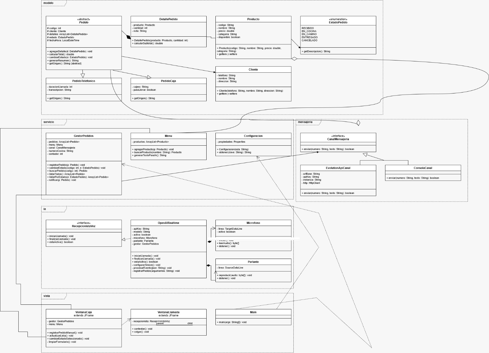

# RimayAI

**Sistema de pedidos para pollería con recepcionista de voz con inteligencia artificial**

*Rimay* significa "hablar" en quechua

---

## ¿Qué problema resuelve?

En hora punta, una pollería no alcanza a contestar todas las llamadas y pierde pedidos. **RimayAI** pone una inteligencia artificial a contestar el teléfono: atiende por voz, toma el pedido, confirma dirección y teléfono, y lo registra sola.

> [!NOTE]
> El sistema **funciona completo sin IA**. La IA lo potencia y lo automatiza, pero si falla, la cajera sigue trabajando normalmente desde la caja.

## Funcionalidades

| Función | Descripción |
|---|---|
| **Caja** | La cajera registra pedidos, ve la lista de todos y cambia su estado |
| **Recepcionista IA** | Atiende la llamada por voz, toma el pedido y confirma los datos |
| **WhatsApp** | El cliente recibe la confirmación y cada cambio de estado; la cocina recibe el pedido |

## Estructura del proyecto

| Paquete | Responsabilidad | Clases |
|---|---|---|
| `modelo` | Datos del negocio | Pedido, PedidoTelefonico, PedidoCaja, DetallePedido, Producto, Cliente, EstadoPedido |
| `servicio` | Lógica central | GestorPedidos, Menu, Configuracion |
| `ia` | Recepcionista de voz | RecepcionistaVoz, OpenAIRealtime, Microfono, Parlante |
| `mensajeria` | Envío de avisos | CanalMensajeria, EvolutionApiCanal, ConsolaCanal |
| `vista` | Pantallas | VentanaCaja, VentanaLlamada, Main |

## Diagrama UML

## Tecnologías

- **Java 21** con **Maven**
- **Swing** (NetBeans) para las pantallas
- **OpenAI Realtime API** para la voz en tiempo real
- **Evolution API** (open source) para WhatsApp

## Equipo

- Fabian Ordoñez
- Marielena Valladares
- Rafael Flores
- Lenning Sandoval

---

Programación Orientada a Objetos - Universidad Tecnológica del Perú

